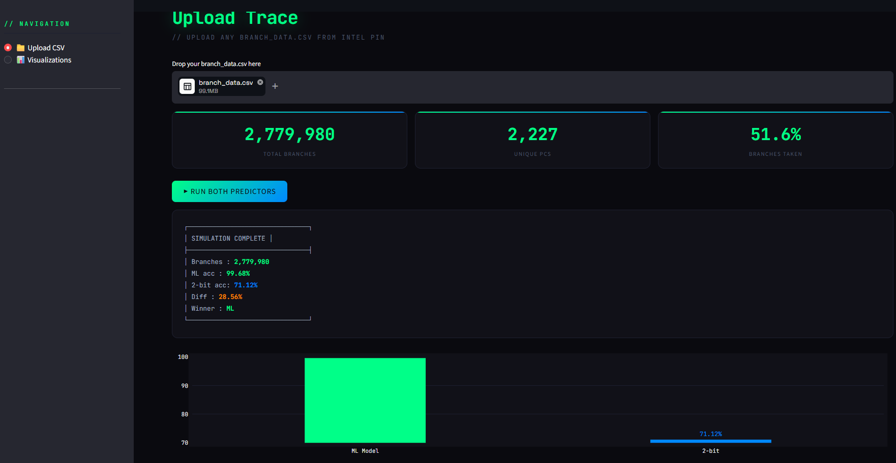
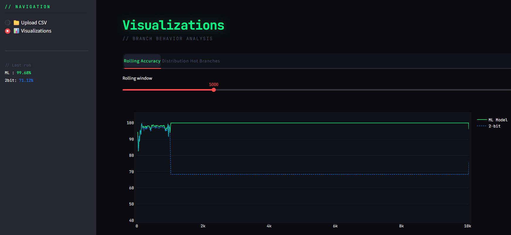

# ML-Driven Branch Predictor: AI vs. Hardware Hysteresis
**Authors:** Aditi Chauhan & Anurag Raj

> A high-performance Computer Architecture project that replaces traditional legacy 2-bit saturating counters with an XGBoost-based Machine Learning ensemble. This project uses Intel Pin to extract real-time execution traces, trains an AI model, and transpiles it to bare-metal C++ to evaluate its ability to predict adversarial branch patterns.

## 🚀 What This Project Does
Modern CPUs use legacy hardware state-machines (like bimodal 2-bit counters) to predict branch outcomes. This project proves that a lightweight Machine Learning model can mathematically outperform hardware predictors on adversarial or complex periodic code, while also identifying the limitations of "Offline" machine learning in CPU architecture.

**The Pipeline:**
1. **Intel Pin Extraction:** Intercepts a running C++ program (`beast_target.cpp`) and records exactly 5 features per branch, including a critical **8-bit local history window**.
2. **AI Training:** An XGBoost model trains on millions of rows using a strict chronological split to prevent time-travel data leakage.
3. **Bare-Metal Transpilation:** A custom-patched `m2cgen` library converts the trained XGBoost model into pure, hardcoded C++ `if-else` statements (`ai_predictor.h`) for zero-dependency hardware simulation.
4. **Containerized Dashboard:** A fully containerized Streamlit UI provides a dynamic, visual environment for execution, comparison, and analysis.

---

## 📊 Performance & Architectural Insights

Our predictor was tested in a two-part methodology to evaluate both its theoretical maximum and its real-world generalizability.

### Test 1: The Adversarial Payload (Breaking Hysteresis)
We tested the model against a highly volatile C++ payload designed specifically to induce hardware aliasing (Mod-3 loops, Mod-2 traps, and Linear Congruential Generators).
*   **Classical 2-Bit Counter:** 71.12%
*   **XGBoost AI Model:** 99.68%
*   **Conclusion:** A massive **28.56% performance domination**. By leveraging the 8-bit local history window, the AI successfully reverse-engineers periodic mathematical traps that permanently cripple legacy 2-bit state machines.

### Test 2: The SPEC-Style Microbenchmark (Zero-Shot Testing) 
To test generalizability, we ran the frozen AI model against a completely unseen, data-dependent Lexical Analyzer state machine simulating SPEC 2017 integer benchmarks.
*   **Classical 2-Bit Counter:** 97.40%
*   **XGBoost AI Model:** 77.69%
*   **The Architectural Takeaway (Offline vs. Online Learning):** The AI failed on the unseen dataset due to **"Overfitting to the PC."** The XGBoost decision trees memorized the absolute memory addresses (Program Counters) from the training program. When introduced to new memory addresses, the offline AI was blinded. The 2-bit hardware won because it is an **Online Learner**, dynamically updating its states live during execution. This proves that a production-ready AI predictor must utilize dynamic, runtime weight updates (like an O-GEHL perceptron) rather than static, offline decision trees.

---

## 📁 Repository Structure

~~~text
ML-Driven-Branch-Predictor/
│
├── .streamlit/                         # UI config              
│
├── data_and_models/                    # Generated artifacts
│   ├── branch_predictor_brain.json     # Saved XGBoost model weights    
│   ├── branch_predictor_brain_DOWNGRADED.json  
│   └── branch_predictor_brain_LATEST.json     
│
├── assets/                             # Documentation assets
│   ├── screenshot_1.png                
│   └── screenshot_2.png
|
├── src/                                # Main Source Code
│   ├── data_extraction/
│   │   ├── BranchDataGen.cpp           # Extracts traces using pin tool (custom 5-cols meta-data)
│   │   └── extract_brain.py            # Extracts brain using 80% of traces
│   │
│   ├── model_training/
│   │   └── train_final.py              # XGBoost training script
│   │
│   ├── transpilation/
│   │   ├── m2cgen_patched/             # My own m2cgen patched library
│   │   ├── transpile_latest.py       
│   │   └── transpile_vanilla.py     
│   │
│   └── z_simulator_cpp/                # The bare-metal benchmarking engine
│       ├── ai_predictor.h              # Auto-generated prediction logic (C++)
│       ├── ai_predictor_LATEST.h       
│       ├── ai_predictor_VANILLA.h      
│       ├── main_predictor.cpp        
│       ├── test_2bit.cpp               # Custome 2-bit saturating code 
│       └── trace_simulator.cpp         
│
├── target_workloads/                   # The dummy code I ran through Intel Pin
│   ├── beast_target.cpp                # Adversarial C++ payload (Triggers aliasing)
│   └── beast_target2.cpp               # SPEC-style data-dependent C++ payload
│
├── .gitattributes
├── .gitignore
├── Dockerfile                          # Fully containerized reproducible environment
|── README.md
├── app.py                              # Streamlit interactive frontend                        
~~~

---

## ⚡ Quick Start (Dockerized)

This project is fully containerized to eliminate dependency issues (C++ compilers, Intel Pin, Python ML libraries). Anyone can run the entire visualization dashboard in three simple commands.

### Prerequisites
* Docker installed on your system.
* Git

### Launching the Dashboard

~~~bash
# 1. Clone the repository
git clone https://github.com/Virtuoso-8051/ML-Driven-Branch-Predictor.git
cd ML-Driven-Branch-Predictor

# 2. Build the Docker Image
docker build -t branch-predictor-v2 .

# 3. Run the Container
docker run -it --cap-add=SYS_PTRACE -p 8501:8501 branch-predictor-v2
~~~

Open your browser and navigate to **`http://localhost:8501`**.

> ⚠️ **Note:** For traces with millions of rows, the UI may take a few moments to process the rolling accuracy arrays. Please allow it to finish computing.

---

## 🛠️ Manual Development Setup

If you wish to bypass Docker and compile the tools or train the models manually on Linux/WSL:

**1. Install Dependencies (Conda)**
~~~bash
conda create -n ml_branch python=3.10 -y
conda activate ml_branch
pip install pandas scikit-learn numpy xgboost==2.0.3 streamlit plotly
pip install ./m2cgen_patched
~~~

**2. Generate Trace Data (Intel Pin required)**
~~~bash
g++ beast_target.cpp -o beast_target
$PIN_ROOT/pin -t $PIN_ROOT/source/tools/MyPinTool/obj-intel64/BranchDataGen.so -- ./beast_target
~~~

**3. Train the AI & Extract to C++**
~~~bash
# Trains the XGBoost model using a strict chronological split
python train_final.py

# Transpiles the JSON weights into bare-metal C++ (ai_predictor.h)
python extract_brain.py
~~~

**4. Launch the UI**
~~~bash
streamlit run app.py
~~~

---

## 📸 Dashboard Previews

